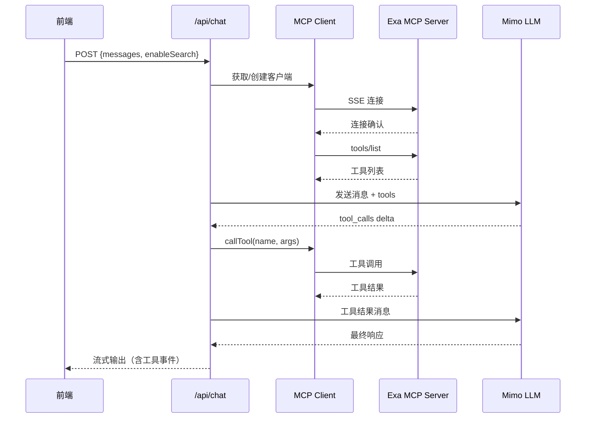

# 2026-05-10 Exa MCP 集成计划

## 概述
实现 Exa MCP 集成，让 LLM 可以自动决定是否调用搜索工具。采用 SSE 方式连接远程 Exa MCP 服务器，工具调用结果内联展示在对话中，并在侧边栏展示搜索结果面板。

## 架构变更

### 环境变量
- `EXA_MCP_URL`: Exa MCP 服务器地址（默认：`https://mcp.exa.ai/mcp`）

### 新增文件
- `lib/mcp-client.ts`: MCP 客户端封装
- `components/search-results-panel.tsx`: 搜索结果侧边栏面板

### 修改文件
- `lib/types.ts`: 新增消息类型和设置字段
- `app/api/chat/route.ts`: 集成工具调用逻辑
- `app/page.tsx`: 添加搜索结果面板和工具状态管理
- `components/chat/message-bubble.tsx`: 显示工具调用和结果
- `components/settings-dialog.tsx`: 添加搜索功能开关和 MCP 服务器配置

## 详细实现

### 1. 类型定义更新 (`lib/types.ts`)
```typescript
export interface ToolCall {
  id: string;
  name: string;
  arguments: Record<string, unknown>;
}

export interface ToolResult {
  toolCallId: string;
  result: string;
}

export interface Message {
  id: string;
  role: "user" | "assistant" | "tool";
  content: string;
  reasoning?: string;
  toolCalls?: ToolCall[];
  toolResults?: ToolResult[];
  timestamp: number;
}

export interface AppSettings {
  apiKey: string;
  apiBaseUrl: string;
  storagePath: string;
  defaultSystemPrompt: string;
  mcpServerUrl: string;
  enableSearch: boolean;
}
```

### 2. MCP 客户端 (`lib/mcp-client.ts`)
- 使用 `@modelcontextprotocol/sdk` 的 SSE 方式连接
- 缓存客户端实例（按 URL）
- 实现 `getTools()` 和 `callTool()` 方法
- 错误处理和重连逻辑

### 3. Chat API 增强 (`app/api/chat/route.ts`)
- 解析请求中的 `enableSearch` 标志
- 如果启用搜索，连接 MCP 服务器并获取工具列表
- 在 LLM 请求中添加 `tools` 参数
- 处理 `tool_calls` delta，执行工具调用
- 将工具结果作为后续消息发送给 LLM
- 流式输出中增加 `tool_call` 和 `tool_result` 事件类型

### 4. 前端状态管理 (`app/page.tsx`)
- 新增 `searchResults` 状态管理
- 监听流式输出中的 `tool_call` 和 `tool_result` 事件
- 更新消息列表，显示工具调用状态
- 添加搜索结果面板的显示/隐藏逻辑

### 5. 消息显示增强 (`components/chat/message-bubble.tsx`)
- 新增 `ToolCallDisplay` 组件：显示工具调用信息
- 新增 `ToolResultDisplay` 组件：显示工具执行结果
- 工具调用中状态显示加载动画

### 6. 搜索结果面板 (`components/search-results-panel.tsx`)
- 可折叠的侧边栏面板
- 显示搜索查询、结果摘要、来源链接
- 支持结果筛选和排序
- 点击结果可展开详细内容

### 7. 设置对话框更新 (`components/settings-dialog.tsx`)
- 新增 "搜索功能" 分组
- 搜索功能开关（`enableSearch`）
- MCP 服务器 URL 输入框（带默认值）
- 测试连接按钮

## 实施步骤

### 阶段 1：基础设施（预计 2 小时）
1. 安装依赖：`@modelcontextprotocol/sdk`
2. 更新 `lib/types.ts` 类型定义
3. 实现 `lib/mcp-client.ts` 客户端封装
4. 更新设置读写逻辑

### 阶段 2：后端集成（预计 3 小时）
5. 修改 `app/api/chat/route.ts` 集成工具调用
6. 实现流式输出中的工具事件处理
7. 添加错误处理和回退机制

### 阶段 3：前端实现（预计 4 小时）
8. 更新 `app/page.tsx` 状态管理
9. 修改 `components/chat/message-bubble.tsx` 显示工具信息
10. 实现 `components/search-results-panel.tsx` 搜索结果面板
11. 更新设置对话框，添加搜索配置

### 阶段 4：测试和优化（预计 2 小时）
12. 端到端测试搜索功能
13. 性能优化和错误处理完善
14. 文档更新

## 技术细节

### MCP 连接流程


### 工具调用协议
- 使用 OpenAI 兼容的 tool_calls 格式
- 工具结果以 `tool` 角色消息发送
- 支持并行工具调用

### 错误处理策略
- MCP 连接失败：回退到纯文本模式，提示用户
- 工具调用超时：30 秒超时，返回错误信息
- 工具执行失败：返回错误描述，让 LLM 决定下一步

## 测试计划

### 单元测试
- MCP 客户端连接和断开
- 工具列表获取
- 工具调用执行

### 集成测试
- 完整搜索流程测试
- 错误场景测试
- 并发请求测试

### 端到端测试
- 用户启用搜索功能
- LLM 自动决定搜索
- 搜索结果正确显示
- 搜索结果面板交互

## 风险评估

### 技术风险
- MCP SDK 兼容性：使用最新稳定版，参考官方文档
- 流式解析复杂性：分阶段实现，先支持基本功能
- 性能影响：添加缓存和连接池

### 缓解措施
- 实现优雅降级：搜索功能失败不影响基本聊天
- 添加配置选项：用户可禁用搜索功能
- 监控和日志：记录工具调用成功率和性能

## 依赖项

### 新增依赖
- `@modelcontextprotocol/sdk`: MCP TypeScript SDK

### 环境变量
- `EXA_MCP_URL`: Exa MCP 服务器地址（必需）

## 后续扩展

### 短期优化
- 支持更多 MCP 工具（代码搜索、公司研究等）
- 搜索历史记录
- 搜索结果缓存

### 长期规划
- 支持本地 MCP 服务器
- 工具调用统计和分析
- 自定义工具配置

## 参考资料
- [Exa MCP Server 文档](https://github.com/exa-labs/exa-mcp-server)
- [MCP TypeScript SDK](https://ts.sdk.modelcontextprotocol.io/v2/documents/Documents.Client_Guide.html)
- [Mimo API 工具调用文档](https://www.mimo-v2.com/docs/usage-guide/tool-calling/web-search)
